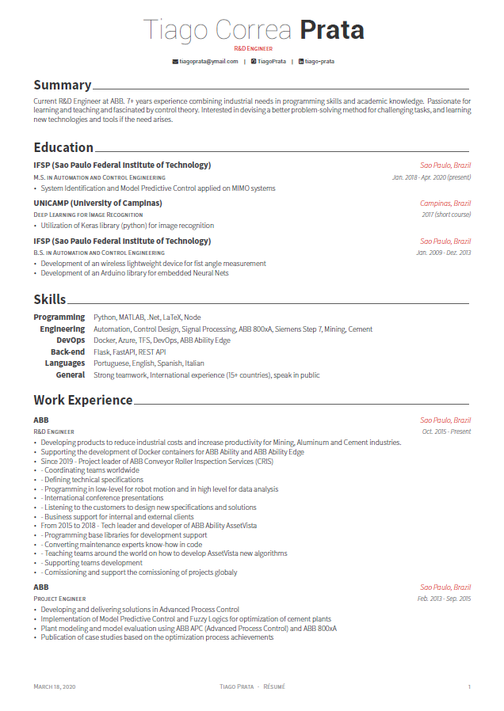

<h1 align="center">
    
   
  Tiago Prata - Resume
</h1>

  Personal LaTeX Resume

  

 

## What is it?

This is my **Personal Résumé** based on the [Awesome-CV](https://github.com/posquit0/Awesome-CV).
You are free to take my `.tex` file and modify it to create your own resume. Please don't use my resume for anything else without my permission, though!

## Preview

You can see [PDF](./files/resume_no-sensitive-data.pdf)

| Page. 1 | 
|:---:|
|   |

## How to Use

#### Requirements

A full TeX distribution is assumed.  [Various distributions for different operating systems (Windows, Mac, \*nix) are available](http://tex.stackexchange.com/q/55437).
For editing it [VSCode](https://code.visualstudio.com/) with the [LaTeX Workshop](https://marketplace.visualstudio.com/items?itemName=James-Yu.latex-workshop) extension is recommended.

## Credit

[**Awesome-CV**](https://github.com/posquit0/Awesome-CV) for creating a simplified template.

[**LaTeX**](http://www.latex-project.org) is a fantastic typesetting program that a lot of people use these days, especially the math and computer science people in academia.

[**LaTeX FontAwesome**](https://github.com/furl/latex-fontawesome) is bindings for FontAwesome icons to be used in XeLaTeX.

[**Roboto**](https://github.com/google/roboto) is the default font on Android and ChromeOS, and the recommended font for Google’s visual language, Material Design.

[**Source Sans Pro**](https://github.com/adobe-fonts/source-sans-pro) is a set of OpenType fonts that have been designed to work well in user interface (UI) environments.

## Contact

If you have any questions, feel free to ping me on [Twitter](https://twitter.com/pratiago).

Good luck!
